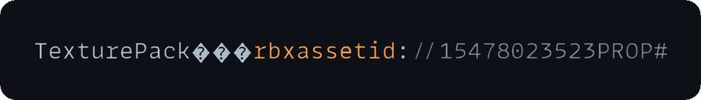

# Dummies Guide To Making Your Own Custom TexturePack Asset
Some dahood skids were gatekeeping so yeah.
(NOTE: This is only for roblox textures. Custom textures of games can't be edited)

## Helpful resources:
[Texture Lib](https://texturelib.com) <br>
[NormalMap-Online](https://cpetry.github.io/NormalMap-Online/) <br>

## Here are the steps:
1. Open up an empty baseplate or any map. Click on "Material Manager" in the Edit group.
<p style='padding: 0 30px'>
    
<p>

2. In the "Material Manager" window, click on "Create Material Variant".
<p style='padding: 0 30px'>
    
<p>

3. Choose a name for your material.
<p style='padding: 0 30px'>
    
<p>

4. Import an image for the Texture Map fields. You can either put in the AssetID if the image is already on roblox or you can upload one form your computer. After you're done editing the material to your liking, click on 'MaterialService' in the Explorer.
<p style='padding: 0 30px'>
    
<p>

5. Right-Click on the material which you named earlier.
<p style='padding: 0 30px'>
    
<p>

6. Choose 'Convert To Package'.
<p style='padding: 0 30px'>
    
<p>

7. Click on 'Submit' to upload it.
<p style='padding: 0 30px'>
    
<p>

8. After you have uploaded it, find it in either your toolbox or your [Dashboard](https://create.roblox.com/dashboard/creations?activeTab=Model), Copy the AssetID and then concatenate it with this url: 
    ```
    https://assetdelivery.roblox.com/v1/asset/?id=<assetid>
    ```
Doing so will allow you to download the model. The name will be random with no extension.
<p style='padding: 0 30px'>
    
<p>

9. Open the file with any text editor. You will notice that some of the file is gibberish. Ignore the gibberish text and look for text named: 'TexturePack'. This will have the id to the TexturePack asset near it. For me it is:
<p style='padding: 0 30px'>
    
<p>

10. (Optional) Now you can either repeat Step 8. to download the TexturePack file, or you can use curl to display the contents of the TexturePack file like so:
    ```
    curl -k -L -s https://assetdelivery.roblox.com/v1/asset/?id=<assetid>
    ```
The output will be similar to this:
<p style='padding: 0 30px'>
    
<p>

Now to use the Texture we made, we need to use it through FFlags. Specifically FStringPartTexturePackTable2022 and FStringPartTexturePackTablePre2022. You will have to replace the AssetId's in the flag(s). The first id will be the id of the TexturePack asset and the second id will be the id of the ColorMap. Do it for all the different materials.

After you are done writing your json, put it into a [JSON Validator](https://jsonlint.com/) if you aren't using a code editor like VSCode or Sublime Text.

It should look something like this:
<p style='padding: 0 30px'>
    
<p>

Now, save your ClientAppSettings.json file and load into a game that you know uses Roblox's default textures. If the textures don't appear, that means you did it wrong. If the textures you made appear, then congratulations, you made your own textures!